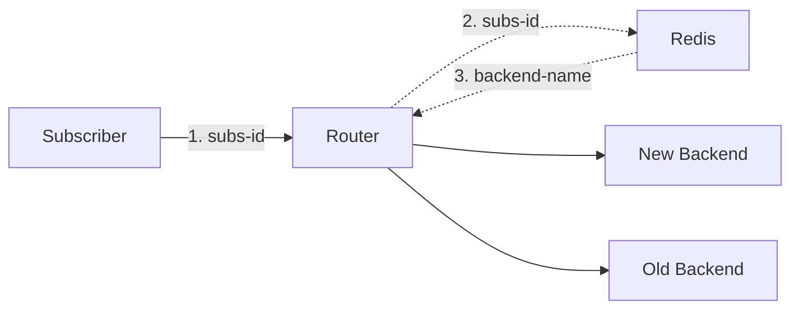

# Nginx Router

## Description

Example of NGINX router implementation serving per-subscriber traffic migration to a new system. 



A routing table consist of subscriber id and backend server map is populated in Redis. This information used by NGINX to do routing decision. Below is the example route table.

|id||backend|
|-|-|-|
|c1|-->|old-be|
|c2|-->|new-be|

The `id` column is the key, and the `backend` column is the value of the key-value pair.

## Routing decision

Subscriber id is extracted from HTTP request, for example URI: `http://router/?id=c1`, the `c1` value is extracted from `id` parameter.
Below is example code using Lua.

```
local args = ngx.req.get_uri_args()
local subsid = args["id"]
```

Then the `c1` value is used to lookup backend server in routing table in Redis. The value returned is match to upstream server configuration in the router.

```
local be, err = r:get(subsid)

if be == ngx.null then
  ngx.say("no backend set")
else
  ngx.var.be = be
end
```

## Using Redis AUTH

Redis configuration defined using a ConfigMap. The `requirepass` parameter is defined.

```
---
apiVersion: v1
kind: ConfigMap
metadata:
  name: redis
data:
  config: |
    requirepass qwertyuiop
```

to verify the configuration

```
$ kubectl exec -it redis-5fcf574c5f-q56s7 -- cat /redis/redis.conf

requirepass qwertyuiop
```

With AUTH enabled, following code must be defined as a step perform authentication

```
rewrite_by_lua_block {
    ...
    local ok, err = r:auth("qwertyuiop")
    ...
}
```

## Usage

1. Apply YAML files in this repo.
    ```
    kubectl apply -f router.yaml
    kubectl apply -f redis.yaml
    kubectl apply -f backends.yaml
    ```
1. Use `redis-cli` inside the Redis pod to populate sampe data
    
    ```
    $ kubectl exec -it redis-5fcf574c5f-4xp2z -- sh
    
    /data # redis-cli
    127.0.0.1:6379> auth qwertyuiop
    OK
    127.0.0.1:6379> set c1 old-be
    OK
    127.0.0.1:6379> set c2 new-be
    OK
    127.0.0.1:6379> 
    ```
1. Testing using a test client pod

    ```
    $ kubectl run client --rm -it --image=nicolaka/netshoot -- /bin/bash
    If you don't see a command prompt, try pressing enter.
    bash-5.1# curl http://router:5000/?id=c1
    OLD BACKEND
    bash-5.1# curl http://router:5000/?id=c2
    NEW BACKEND
    bash-5.1# 
    ```

## Extra: Populating data using Python

You can populate routing table data using Python. From test client pod, you can install Python Redis 

```
pip install redis
```

Then create new file and paste below code

```
import redis
r = redis.Redis("redis.default.svc.cluster.local", 6379)
r.auth("qwertyuiop")

r.set("c1", "old-be")
r.set("c2", "new-be")
```